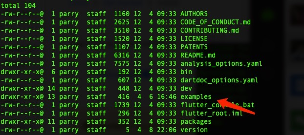
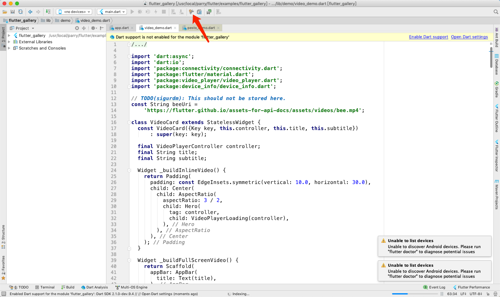
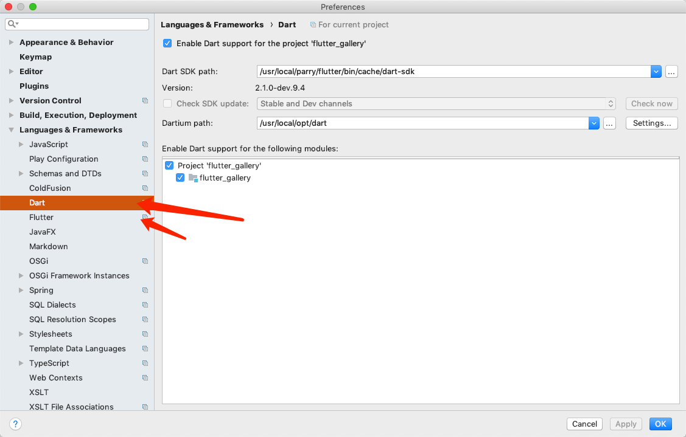

# 开始前的准备

推荐intellij编辑器 
下载地址 https://www.jetbrains.com/idea/
注册码地址 http://idea.lanyus.com/
intellij flutter插件安装


去官网下载sdk https://flutter.dev/docs/get-started/install
然后还需要按不同的平台去安装相应的东西 配置好环境变量之后可以运行检查flutter所需要其他东西
``` bash
flutter doctor
```
我们可以在下载的sdk中找到示例



导入到intellij中一个示例 我们需要配置Intellij的dart 也要配置flutter





一切准备就续之后就可以点击运行了 在这里推荐使用外接数据线的形式进行调试 因为模拟器是不准确的 而且开发的形式也是所见即所得的热更新模式

